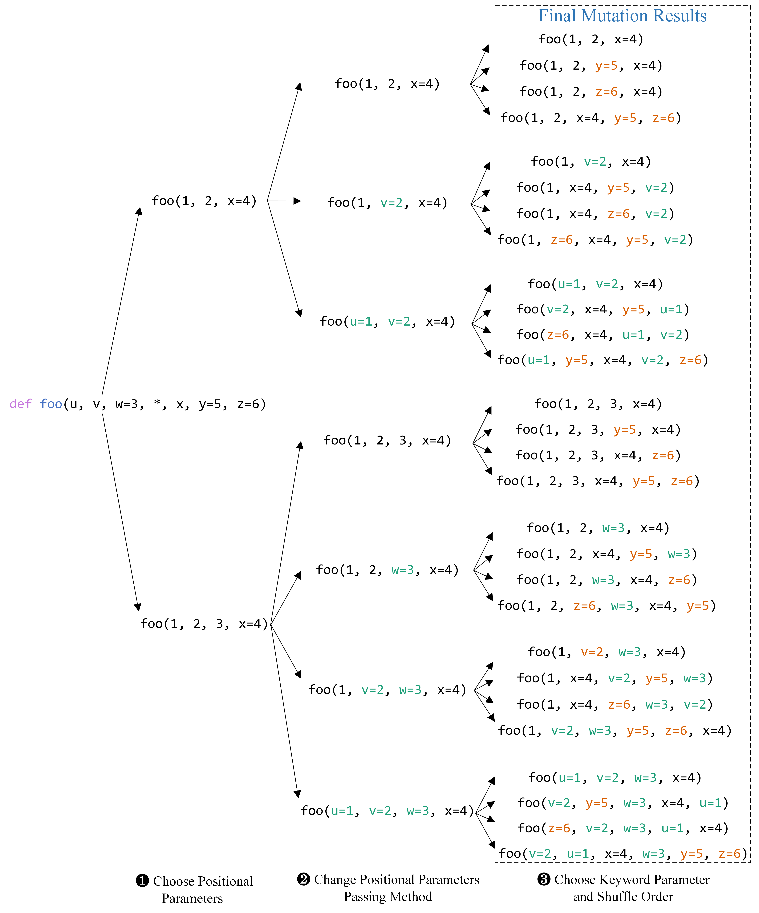

## What is PCBench?
PCBench is a large-scale benchmark with `47,478` test cases with compatibility labels, covering `844` parameter-changed APIs from `33` popular Python third-party libraries. The large-scale dataset serves as a benchmark for evaluating the detection and repair tools of Python API parameter compatibility
issues.

## Directory Structure

```
├── Benchmark
    ├── Library
        ├── API@V1-V2
            ├── APIV1.yml
            ├── APIV2.yml
            ├── test_case#1YY
                ├── test_case.py
            ├── test_case#2YY
                ├── test_case.py
            ...
            └──
        ├── API@V1-V2
            ...
        └──
    ...
    └──
```
- Library: Python third-party library name
- API@V1-V2: an API that has changes between version v1 and v2
- APIV1.yml: the anaconda virtual environment configuration file contains the library version V1
- APIV2.yml: the anaconda virtual environment configuration file contains the library version V2
- test_case#1YY: the first test case generated by the API, where the first Y means compatible and the second Y means runnable
- test_case.py: code snippet


## How to install virtual environments?
### Method 1:
Run the following command to install the virtual environment.
```shell
conda env create -f environment.yml
```

### Method 2:
Download the .tar.gz package from the [PCBenchVenvs](https://pan.nuaa.edu.cn/share/c5270595cf89e58b6d2ea76f28) and install the virtual environment by executing the following command. 
```shell
cd /home/usr/anaconda3/envs
mkdir envName
tar -xzvf envName.tar.gz -C envName
```

_Note, a few envs may still missing some system libraries (e.g., libopenblas.so.0), which should be installed through apt._

## An example of parameter mutation on foo for generating test cases


## Usage
### Prerequisites
- Python 3.9
- openpyxl 3.1.2
- anaconda 23.5.2

### Run Command
```shell
python run.py
```

### How does PCART use it?
Each test case in PCBench can be regarded as an independent test project, for using [PCART]([https://github.com/pcart-tools/PCART]) to detect and repair compatibility issues on PCBench, you need to create the virtual environments of the test case's current version and the target version based on the `.yml` files, and then create a json configuration file as follows:
```json
{
    "projPath": "/home/usr/Benchmark/flask/flask.json.load@2.2.5-2.3.0/flask.json.load#1YY",
    "runCommand": "python loadYY.py",
    "runPath": "",
    "libName": "flask",
    "currentVersion": "2.2.5",
    "targetVersion": "2.3.0",
    "currentEnv": "/home/usr/anaconda3/envs/flask2.2.5",
    "targetEnv": "/home/usr/anaconda3/envs/flask2.3.0"
} 
```
Run command as follows
```shell
python main.py -cfg config.json
```
