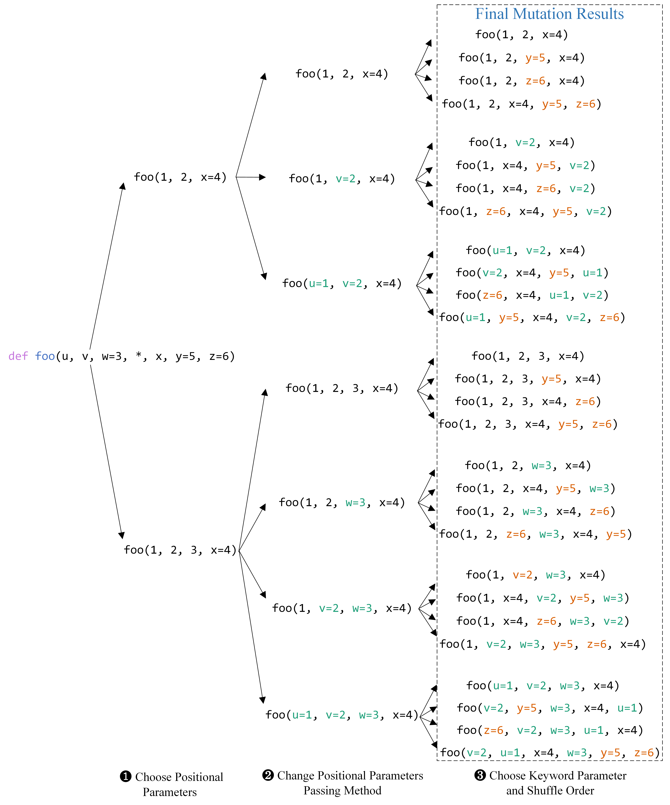

## What is PCBench?
PCBench is a large-scale benchmark with `47,478` test cases, each labeled with compatibility information, covering `844` parameter-changed APIs from `33` popular Python third-party libraries. This large-scale dataset serves as a benchmark for evaluating the detection and repair tools of Python API parameter compatibility issues.

## Directory Structure

```
├── Benchmark
    ├── Library
        ├── API@V1-V2
            ├── APIV1.yml
            ├── APIV2.yml
            ├── test_case#1YY
                ├── test_case.py
                ├── test_case.json
            ├── test_case#2YY
                ├── test_case.py
                ├── test_case.json
            ...
            └──
        ├── API@V1-V2
            ...
        └──
    ...
    └──
```
- **Library**: Python third-party library name.
- **API@V1-V2**: An API with parameter changes between version V1 and V2.
- **APIV1.yml**: An Aanconda virtual environment configuration file containing the library version V1.
- **APIV2.yml**: An Anaconda virtual environment configuration file containing the library version V2.
- **test_case#1YY**: The first test case generated by the API, where the first 'Y' means compatible, where the second 'Y' means runnable.
- **test_case.py**: Code snippet.
- **test_case.json**: Configuration file for PCART.


## How to Install Virtual Environments?
### Method 1:
Run the following command to install the virtual environment.
```shell
conda env create -f environment.yml
```

### Method 2:
Download the `.tar.gz` packages from [PCBenchVenvs](https://drive.google.com/drive/folders/1-A5Km23bgWWAXhC3U3gVtIq8MI5mraJ5) or [PCBenchVenvs](https://pan.nuaa.edu.cn/share/c5270595cf89e58b6d2ea76f28) (faster in China) and install the virtual environment by executing the following commands: 
```shell
cd /home/usr/anaconda3/envs
mkdir envName
tar -xzvf envName.tar.gz -C envName
```

_Note: Some envs may still be missing system libraries (e.g., libopenblas.so.0), which should be installed using `apt` or `conda`, e.g., `conda install -c conda-forge openblas
`._


## Example of Parameter Mutation on `foo` for Generating Test Cases


## Usage
### Prerequisites
- Python 3.9
- openpyxl 3.1.2
- anaconda 23.5.2

### Run Command
```shell
python run.py
```

### How Does PCART Use It?
Each test case in PCBench can be regarded as an independent test project. To use [PCART]([https://github.com/pcart-tools/PCART]) to detect and repair compatibility issues in PCBench, you need to create the virtual environments for the test case's current version and the target version based on the `.yml` files, and then create a JSON configuration file as follows:
#### Write Configuration Files Manually
```json
{
    "projPath": "/home/usr/Benchmark/flask/flask.json.load@2.2.5-2.3.0/flask.json.load#1YY",
    "runCommand": "python loadYY.py",
    "runFilePath": "",
    "libName": "flask",
    "currentVersion": "2.2.5",
    "targetVersion": "2.3.0",
    "currentEnv": "/home/usr/anaconda3/envs/flask2.2.5",
    "targetEnv": "/home/usr/anaconda3/envs/flask2.3.0"
} 
```
#### Generate Configuration Files Automatically
```shell
python generateJson.py
```
Then, copy the configuration file to `PCART/Configure` and run command as follows:
```shell
python main.py -cfg config.json
```

## License

The code in this repository is licensed under the GNU Affero General Public License v3.0. See [LICENSE](./LICENSE) for details.

The benchmark data, documentation, and evaluation artifacts in this repository are licensed under the Creative Commons Attribution 4.0 International License (CC BY 4.0).
